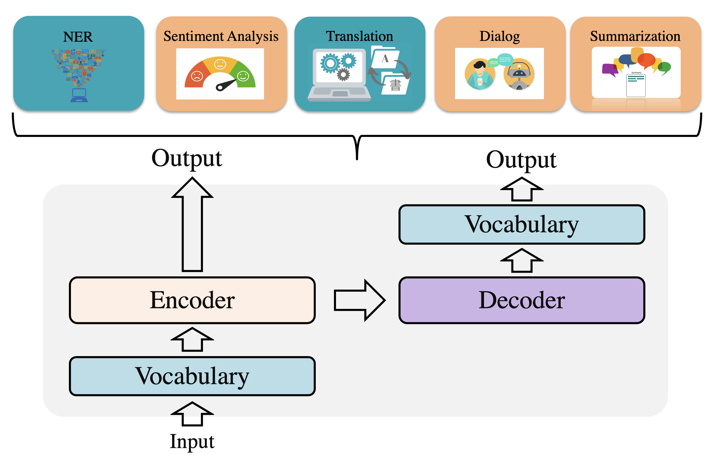
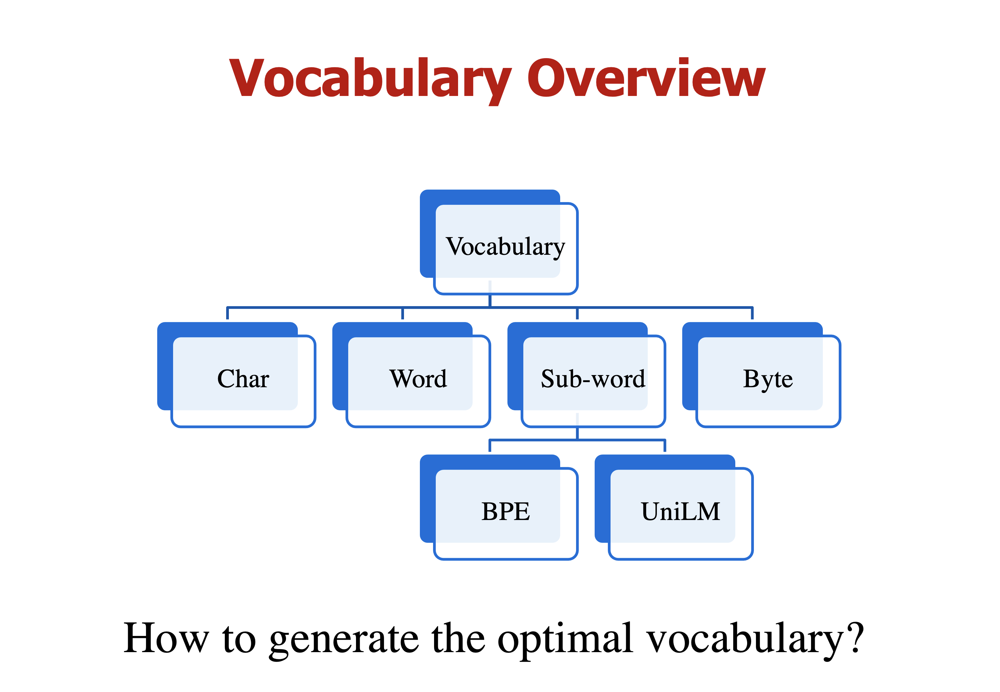
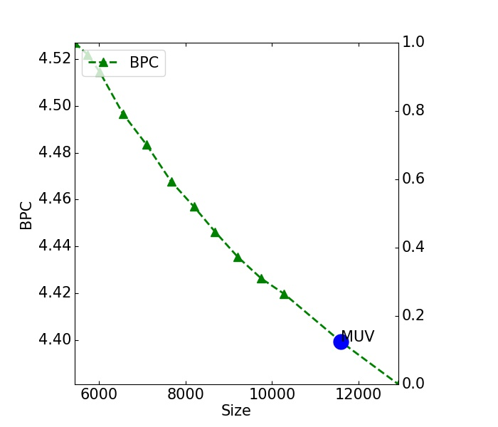
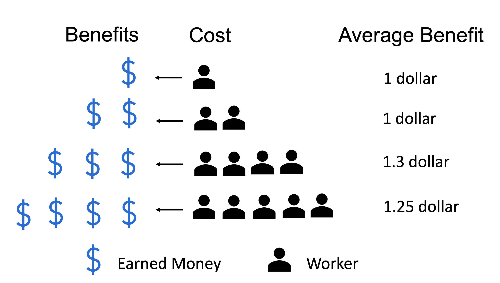
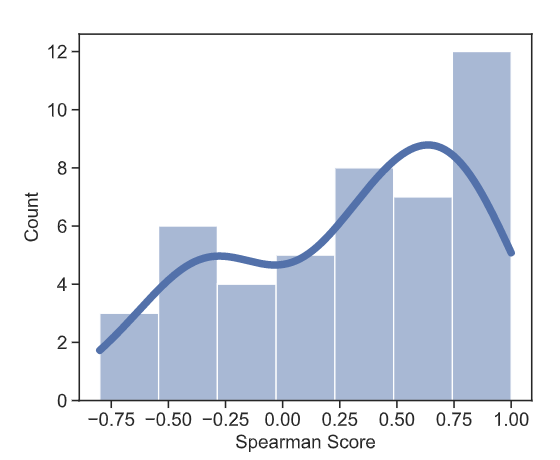
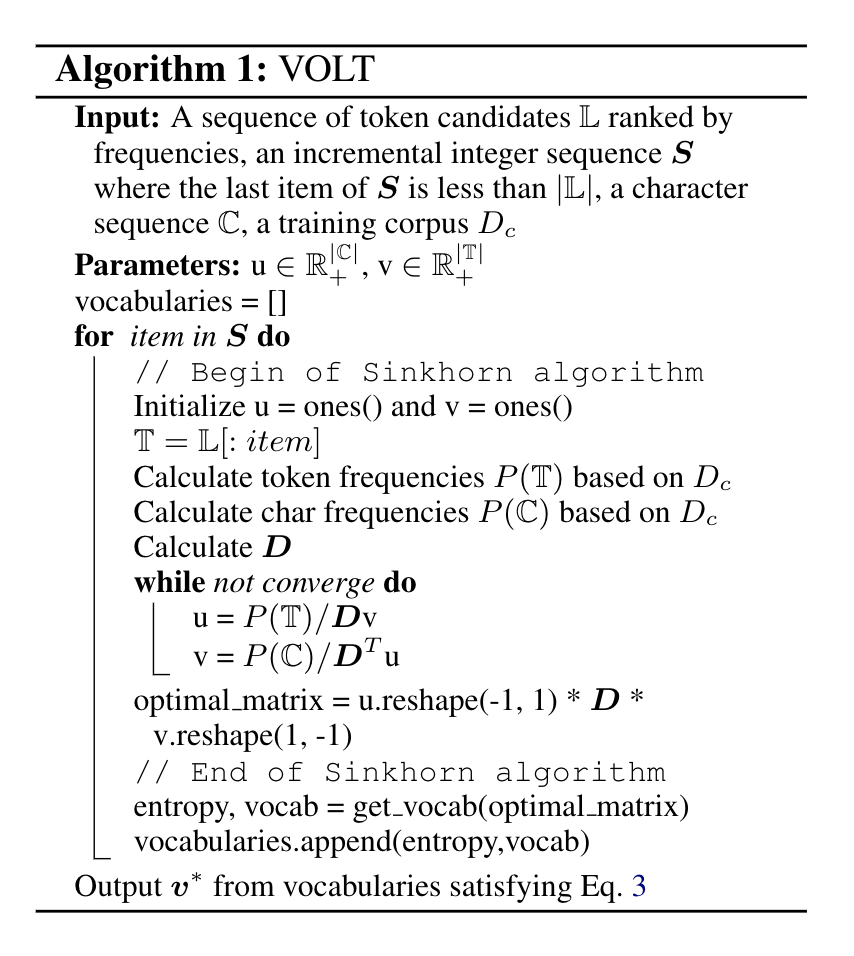
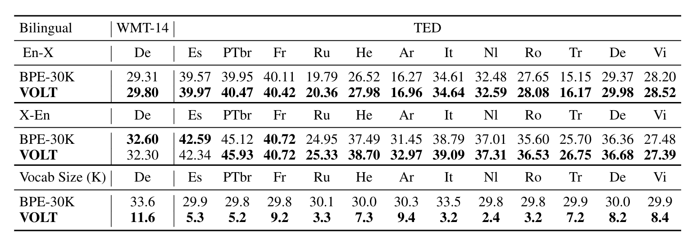
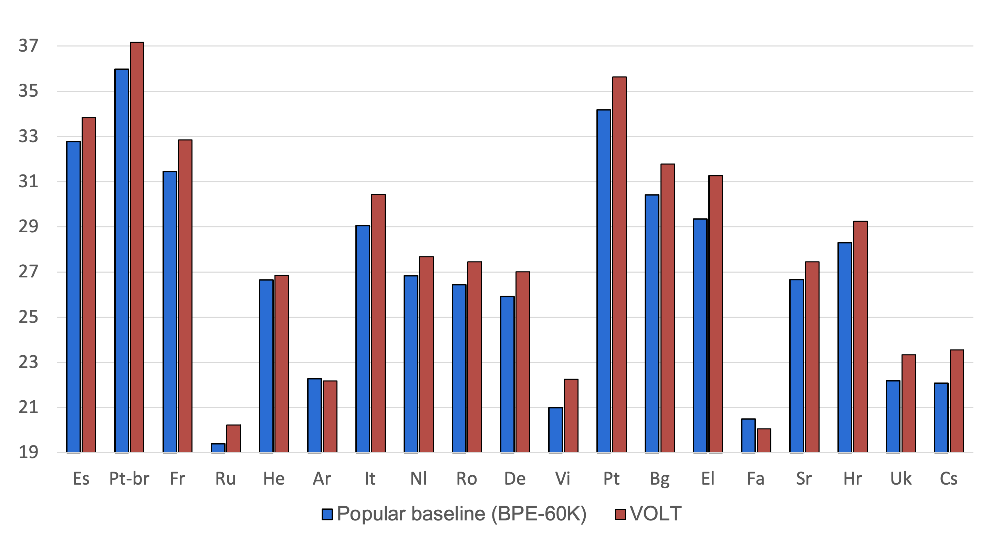
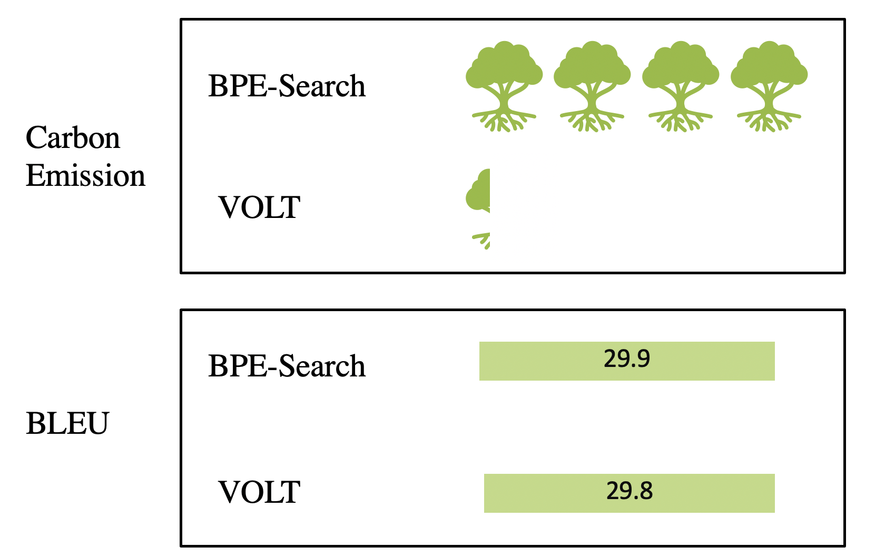

<head>

</head>

# Vocabulary Learning via Optimal Transport for Neural Machine Translation

VOLT is a research work exploring how to generate the optimal vocabulary for neural machine translation. In recent days, this paper got a lot of attentions and we also received several questions from readers. To help more readers understand our work better, I write this blog. In this blog, I will try my best to explain the formulations and motivations behind VOLT. I will use easy-to-understand examples for illustration (maybe not very rigorous for paper writing but somehow ok for blogs).  If you have more questions, please feel free to contact us. You can find our e-mails on the [published paper](https://arxiv.org/abs/2012.15671). 
##Outline
[toc]

## Vocabulary: The Fundamental Component
Vocabulary is a fundamental component for NLP. Due to the discreteness of text, vocabulary construction is a prerequisite for neural machine translation (NMT) and many other natural language processing (NLP) tasks using neural networks. It plays as a lookup table responsible for transferring discrete tokens into dense vectors and recovering the discrete tokens from the output distribution. 

 

Researchers recently have proposed several advanced vocabularization approaches, like word-level approaches, byte-level approaches, character-level approaches, and sub-word approaches. Initially, most neural models were built upon word-level vocabularies. While achieving promising results, it is a common constraint that word-level vocabularies fail on handling rare words under limited vocabulary sizes. Currently, the most domainant segmentation approaches are sub-word level approaches. Byte-Pair Encoding (BPE)  is the first one to get subword-level vocabularies. The general idea is to merge pairs of frequent character sequences to create sub-word units. Sub-word vocabularies can be regarded as a trade-off between character-level vocabularies and word-level vocabularies. Compared to word-level vocabularies, it can decrease the sparsity of tokens and increase the shared features between similar words, which probably have similar semantic meanings, like “happy” and “happier”. Compared to character-level vocabularies, it has shorter sentence lengths without rare words. 

 

<!-- 
 

 -->

Despite promising results, most existing subword approaches only consider frequency (or entropy) while the effects of vocabulary size is neglected. Thus, trial training is required to find the optimal size, which brings high computation costs. In this work, we aim to figure out how to evaluate vocabularies and whether one can find the optimal vocabulary without trial training. In the next, I will introduce our work following these two questions. 

## How to Evaluate Vocabulary?
In this work, we mainly consider two factors to understand vocabularies: entropy and size. 

<!-- %Many previous studies show that vocabulary size also affects downstream performances, especially on low-resource tasks. However, the effects of vocabulary size are not sufficiently taken into account since current approaches only consider frequency (or entropy) as the main criteria. Due to the lack of appropriate inductive bias about size, trial training (namely, traversing all possible sizes) is usually required to search for the optimal size, which takes high computation costs. For convenience, most existing studies only adopt the widely-used settings in implementation.  -->

**Size is an essential factor.** From the pespective of size, a vocabulary with smaller size is a better choice. Smaller size usually means less rare tokens and less parameters. 

**Entropy is also an important factor.** Currently, sub-word approaches like Byte-Pair Encoding (BPE) are widely used in the community. In information theory, BPE are simple forms of data compression. The target is to reduce the entropy (or bits-per-char) of a corpus, which uses fewer bits to represent the corpus than the character-level segmentation. Therefore, entropy is a natural factor to be considered. In this work, we borrow the idea of entropy and define a concept called information-per-char (**IPC** for short), a normalized entropy here. We can understand IPC as semantic information per char. Less IPC means less average semantic information per character, which benefits models to differentiate these tokens and benefits for model learning. Also, compared to char-level vocabularies, BPE brings smaller IPC also with better performance. Therefore, smaller IPC is supposed to be better. Formally, IPC is calculated as
$$ \mathcal{H}_{v} = - \frac{1}{l_{v}}\sum_{j \in v } P(j)\log P(j)$$

where $v$ represents a vocabulary and $l_{v}$ is the average length of $v$. $P(j)$ is the frequency of $j$-th token in the training data. The following figure shows how IPC changes with the increase of vocabulary size (We take BPE as an example). We sample several figures in dir "img/". 

 

**Conflicted Factors** As discussed before, IPC and size are two conflicted factors. From the perspective of size, a BPE vocabulary with smaller size is expected. From the perspective of IPC, a BPE vocabulary with larger size is expected since a BPE vocabulary with larger size usually has smaller IPC. Previous studies mainly use full training and testing on downstream tasks to select the best vocabulary. In this work, we aim to explore a more challenging problem: How to evaluate vocabulary efficiently?

**MUV: The tradeoff between IPC and size.**  To model such a tradeoff, we borrow the concept of **Marginal Utility** in economics and propose to use Marginal Utility of Vocabularization(MUV) as the optimization objective.
 MUV evaluates the benefits (IPC reduction)  a corpus can get from an increase of cost (size). Higher MUV is expected for a higher benefit-cost ratio. Here we give an illustrative example to understand MUV. 
 <!-- 
 

 -->
<!-- 
 Imagine we have a single worker who can earn $1 one day. With the increase of the number of workers, of course, we can get more benefits. However, each work brings different benefits on different timesteps. We regard the number of workers with the maximum benefits as the optimal (cost-effective) point. It is the most straightforward approximation. Since we can still get positive benefits from the increase of workers, it is ok to define a better formulation if more costs are tolerable.  For convenience, we use the cost-effective point as the optimal one. 
  --> Formally, marginal utility is defined as gradients. Here we use $\frac{\Delta y}{\Delta x}$ to approximate marginal utility: 
 $$\mathcal{M}_{v(k+m)} = \frac{-(\mathcal{H}_{v(k+m)}-\mathcal{H}_{v(k)})}{m}$$ where $\mathcal{H}$ represents the IPC score. $v(k+m)$ and $v(k)$ are two vocabularies with length $k+m$ and $k$. $M$ represents the MUV score. 

 On almost all languages, we find a consistent observation For BPE vocabularies. At the start, the IPC score decreases faster and faster with the increase of frequent tokens. After it reaches the point with the maximum gradients, that is marginal utility score, the speed of IPC reduction will be slower and slower. That is to say, the increase of costs does not bring too much benefits. We can stop at the point with the maximum marginal uitilty. It is the most straightforward approximation. Since we can still get positive benefits from the increase of costs, it is ok to define a better formulation if more costs are tolerable. For convenience, we use the cost-effective point as the optimal one. 
 <!-- 
 
 

 -->
 

 **Results.** To verify the effectiveness of MUV as the vocabulary measurement, we conduct experiments on 45 language pairs from TED and calculate the Spearman correlation score between MUV and BLEU scores. We adopt the same and widely-used settings to avoid the effects of other attributes on BLEU scores, such as model hyper-parameters and training hyper-parameters. We generate a sequence of vocabularies with incremental sizes via BPE.   All experiments use the same hyper-parameters. Two-thirds of pairs show positive correlations. The middle Spearman score is 0.4.  Please refer to our paper for more dataset details. We note that the spearman score is not very high for some datasets.  Actually, many factors can affect BLEU scores. It is hard to get solid correlation scores between BLEU and any factors. Therefore, we believe that such correlation scores are acceptable for these complicated relations. 

 

 

## How to Find the Optimal Vocabulary?
Given MUV, we have two natural choices to get the final vocabulary: search and learning. In the search-based direction, we can combine MUV with widely-used vocabularization solutions (MUV-Search for short). For example, the optimal vocabularies can be obtained by enumerating all candidate vocabularies generated by BPE. It is a simple and effective approach. According to our results, we recommend this solution because it can search for a better vocabulary than widely-used vocabulary. However,  despite the simplicity, this approach requires a lot of time to generate vocabularies and calculate MUV. To address these problems, we further explore a more general solution, VOLT, to explore more vocabulary possibilities. 

### Problem Definition
Given MUV scores, the problem of searching for the optimal vocabulary can be transferred to the problem of searching for the vocabulary with the maximum MUV scores. 
 

However, the main challenge is the discrete and huge vocabulary space. Strictly speaking, we need to enumerate all vocabulary sizes. This paper simplifies this problem by searching for the optimal vocabulary from vocabularies with fixed sizes. 

We introduce an auxiliary variable $\bm S$ ($\bm S$ is an incremental integer sequence) to define these fixed sizes. Formally, $\bm S = \{k, 2\cdot k, ..., (t-1)\cdot k, \cdots \}$ where each timestep $t$ represents a set of vocabularies with the length **up to** $\bm S[t]$. $k$ is the interval size. (Here is "up to", rather than "equal to").

That is to say, we only need to enumerate all vocabularies with sizes defined by sequence $\bm S$.  For a vocabulary with size $\bm S[t]$, its MUV score also relies on a smaller vocabulary. For simplification, we adopt the vocabulary from vocabularies with size $\bm S[t-1]$ to calculate the MUV socres for vocabularies with size  $\bm S[t]$. The problem can be formulated as: 
$$\argmax_{t}\argmax_{v(t-1)^ \in \mathbb{V}_{\bm S[t-1]}, v(t) \in \mathbb{V}_{\bm S[t]}} \mathcal{M}_{v(t)}  =  \argmax_{t}\argmax_{v(t-1) \in \mathbb{V}_{\bm S[t-1]}, v(t) \in \mathbb{V}_{\bm S[t]}}  - \frac{1}{k} \big [ \mathcal{H}_{v(t)} - \mathcal{H}_{v(t-1)} \big ]$$ where $\mathbb{V}_{\bm S[t]}$ and $\mathbb{V}_{\bm S[t-1]}$ represent vocabulary sets with size $\bm S[t]$ and $\bm S[t-1]$, respectively. $\mathcal{H}$ is the function to calculate IPC score. We use $k$ to estimate the size gap between two vocabularies $v(t-1)$ and $v(t)$.  

**An Intuitive Understanding.** The inner $\argmax_{v(t-1)^ \in \mathbb{V}_{\bm S[t-1]}, v(t) \in \mathbb{V}_{\bm S[t]}}$ represents that the target is to find the vocabulary from $\mathbb{V}_{\bm S[t]}$ with the maximum MUV scores. The outer $\argmax$ means that the target is to enumerate all timesteps and find the vocabulary with the maximum MUV scores. 

**Additional Notes**  For a valid $\mathcal{H}$, the size of $v(t-1)$ is required to be smaller than $v(t)$. Actually, in our formulation the size of $v(t-1)$ may be larger than $v(t)$. Therefore, the search space contains illegal paris ($v(t-1)$, $v(t)$). Actually, following our IPC curves, we can find that smaller vocabulary usually have large $\mathcal{H}$. According to these findings, we can assume the following holds: $$\argmax_{illegal \ pair (v(t-1), v(t))}-(\mathcal{H}_{v(t)} - \mathcal{H}_{v(t-1)}) \lt \argmax_{valid \ pair (v(t-1), v(t))}-(\mathcal{H}_{v(t)} - \mathcal{H}_{v(t-1)}) $$ 
Therefore, these illegal pair does not affect our results. 

### Problem Re-formulation
The target problem is a discrete optimization problem. We propose formulating it into a widely-studied discrete optimization problem, optimal transport, and then adopting the advanced solutions to optimize our problem.

The re-formulation is a little bit of complicated. We start from the upper bound of the target problem (Eq.1):
$$\argmax_{t}\big [ \max_{v(t) \in \mathbb{V}_{\bm S[t]} }\mathcal{H}_{v(t)} -  \max_{v(t-1) \in \mathbb{V}_{\bm S[t-1]}} \mathcal{H}_{v(t-1)} \big ] $$

**Why is this objective the upper bound?** If we ignore the outer $\argmax$ and only consider the inner $\argmax$, we can get the following re-formulation:
$$\argmax_{v(t-1) \in \mathbb{V}_{\bm S[t-1]}, v(t) \in \mathbb{V}_{\bm S[t]}}  - \frac{1}{k} \big [ \mathcal{H}_{v(t)} - \mathcal{H}_{v(t-1)} \big ] \Leftrightarrow \argmin_{v(t-1) \in \mathbb{V}_{\bm S[t-1]}, v(t) \in \mathbb{V}_{\bm S[t]}} \big [ \mathcal{H}_{v(t)} - \mathcal{H}_{v(t-1)} \big ]$$  where the $k$ is a constant that does not affect the optimization, which can be ignored. We can further re-formulate the target into:
$$\argmin_{v(t-1) \in \mathbb{V}_{\bm S[t-1]}, v(t) \in \mathbb{V}_{\bm S[t]}} \big [ \mathcal{H}_{v(t)} - \mathcal{H}_{v(t-1)} \big ] \Leftrightarrow \argmin_{v(t) \in \mathbb{V}_{\bm S[t]}}\mathcal{H}_{v(t)} - \argmax_{v(t-1) \in \mathbb{V}_{\bm S[t-1]}}\mathcal{H}_{v(t-1)}$$ and we can get the upper bound is: $$\argmin_{v(t) \in \mathbb{V}_{\bm S[t]}}\mathcal{H}_{v(t)} - \argmax_{v(t-1) \in \mathbb{V}_{\bm S[t-1]}}\mathcal{H}_{v(t-1)} \lt \argmax_{v(t) \in \mathbb{V}_{\bm S[t]}}\mathcal{H}_{v(t)} - \argmax_{v(t-1) \in \mathbb{V}_{\bm S[t-1]}}\mathcal{H}_{v(t-1)} $$

**Why do we start from the upper bound?** The motivation is pretty simple somehow. It is because we want to transfer the target into the entropy-based optimal transport formulation. The original target usually contains $\argmax(\mathcal{H})$. In this way, we only need to calculate the maximum entropy given each timestep.

## Solution

Given the upper bound, the only thing we need to do is to find a vocabulary from $\mathbb{V}_{\bm S[t]}$ with the maximum entropy score. Then, we can enumerate all timesteps to find the best one satisfying the upper bound of the target. Formally, we re-write the target $\argmax_{v(t) \in \mathbb{V}_{\bm S[t]}}\mathcal{H}_{v(t)}$ into $$ \min_{v \in \mathbb{V}_{\bm S[t]} } \frac{1}{l_{v}}\sum_{j\in v} P(j)\log P(j), \\
\text{s.t.}\quad  P(j) = \frac{\text{Token}(j)}{\sum_{j\in v }\text{Token}(j)}, \,\, l_v = \frac{\sum_{j\in v} len(j)}{|v|}$$ 
where $\text{Token}(j)$ is the frequency of token $j$ in the vocabulary $v$. $len(j)$ represents the length of token $j$.  Notice that both the distribution $P(j)$ and the average length $l_v$ depend on the choice of $v$. 

For simplification, we start from a BPE vocabulary containing top $S[t]$ most frequent tokens.  Formally, let $\mathbb{T}\in \mathbb{V}_{\bm S[t]}$ be the vocabulary containing top $S[t]$ most frequent tokens, $\mathbb{C}$ be the set of chars and $|\mathbb{T}|, |\mathbb{C}|$ be their sizes respectively.  The following inequation holds:
$$\min_{v \in \mathbb{V}_{\bm S[t]} } \frac{1}{l_{v}}\sum_{j\in v} P(j)\log P(j)
     \leq \frac{1}{l_\mathbb{T}} \sum_{j \in \mathbb{T}} P(j) \log P(j)$$
**Why does this inequation hold?** The left term is the minimum negative entropy value for all vocabulary candidates. The right term is the negative entropy value for a specific vocabulary. Of course, the left term is less than the right term. 

**How do we solve this optimization problem?** We start from the upper bound of the above objective function, that is $\frac{1}{l_\mathbb{T}} \sum_{j \in \mathbb{T}} P(j) \log P(j)$ and then search for a refined token set from $\mathbb{T}$. In this way, we reduce the search space into the subsets of $\mathbb{T}$. Let $P(i, j)$ be the joint probability distribution of the tokens and chars that we want to learn where $i$ means the $i$-th character and $j$ means the $j$-th token candidate. Then we have
$$\min\sum_{j\in \mathbb{v}} P(j) \log P(j) = \min[\underbrace{\sum_{i\in \mathbb{C}} \sum_{j\in \mathbb{v}} P(i,j)\log P(i, j)}_{\mathcal{L}_1} 
    + \underbrace{ \sum_{i\in \mathbb{C}} \sum_{j\in \mathbb{v}}P(i,j)(-\log P(i | j))}_{\mathcal{L}_2}]$$ where $v$ is the sebset of $\mathbb{T}$. The second term $\mathcal{L}_2$ is exactly equal to zero for a valid P. If the character $i$ in the token $j$, $\log P(i | j)=\log1=0$. If the character $i$ not in the token $j$, $P(i,j)=0$. The second item is always set to be zero.
**Why do we add the second term?**  It is used to match the target of optimal transport. You can follow the next section for more details.  

Since $\mathcal{L}_1$ is nothing but the negative entropy of the joint probability distribution $P(i, j)$,  we shall denote it as $- H(P)$. Let $\bm D$ be the $|\mathbb{C}| \times |\mathbb{T}|$ matrix whose $(i, j)$-th entry is given by $-\log P(i | j)$, and let $\bm P$ be the joint probability matrix, then we can write
$$ \mathcal{L}_2 = \left<\bm P, \bm D\right> = \sum_{i}\sum_{j}\bm P(i,j)\bm D(i,j)$$ Here we transport the problem into the optimal transport target
$$\argmin\left<\bm P, \bm D\right>-H(P)$$

**Setup of OT** From the perspective of optimal transport, $\bm P$ can be regarded as the transport matrix, and $\bm D$ can be regarded as the distance matrix.  Intuitively, optimal transport is about finding the best transporting mass from the char distribution to the target token distribution with the minimum work defined by $\left<\bm P, \bm D \right> $.  $\bm D$ actually is the $-\log P(i | j)$ matrix. First,  we set the distance to  $+\infty$ if the target token $i$ does not contain the char $i$. Otherwise, we use $\frac{1}{len(j)}$ to estimate $ P(i | j)$ where $len(j)$ is the length of token $j$.

Furthermore, the number of chars is fixed, and we set the sum of each row in the transport matrix to the probability of char $i$. The upper bound of the char requirements for each token is fixed, and we set the sum of each column in the transport matrix to the probability of token $j$.

Formally, the constraints are defined as:
$$ \argmin_{\bm P \in \R^{|\mathbb{C}| \times |\mathbb{T}|}} - H(\bm P) + \left<\bm P, \bm D\right>, \\
 \text{s.t.}\quad  \sum_{i} \bm P(i, j) = P(j), \quad |\sum_j \bm P(i, j) - P(i)| \leq \epsilon$$

 ### Implementation
 At each timestep, we can get the vocabulary with the maximum entropy based on the transport matrix.  It is inevitable to handle illegal transport cases due to relaxed constraints. We remove tokens with distributed chars less than $0.0001$ token frequencies. Finally, we enumerate all timesteps and select the vocabulary satisfying Eq.1 as the final vocabulary. The following figure shows the details of VOLT. 
 
 

 

 
The inputs to VOLT contain training data, token candidates in training data, character sets, an incremental integer sequence $\bm S$. In this work, we use the tokens generated by BPE for initialization. Of course, you can use other approaches to get token candidates.  

We use the Sinkhorn algorithm in implementation. The algorithm defines two parameters: $u$ and $v$. We just used the standard solution. You can refer to [Optimal Transport](https://arxiv.org/abs/1803.00567) for algorithm details. 

Finally, we enumerate all sizes in $\bm S$ to calculate the maximum entropy and associated with vocabulary. The vocabulary satisfying the upper bound of the target is the final choice. 

## Results
We compare VOLT with popular vocabularies. For bilingual translation, we use BPE-30K as the popular vocabulary choice. For multilingual, we use BPE-60K as the popular vocabulary choice. In this blog, I post some main results. You can refer to the full paper for more results. 

### Bilingual Translation
We conduct experiments on WMT En-De translation, TED bilingual translation. As we can see, the vocabularies searched by VOLT achieve higher or competitive BLEU scores with large size reduction.  The promising results demonstrate that VOLT is a practical approach that can find a well-performing vocabulary with higher BLEU and smaller size.

 

 
### Multilingual Translation
 We also conduct experiments on multilingual translation.  These languages come from multiple language families and have diverse characters.  The size of the searched vocabulary is around 110K. As we can see, VOLT achieves better BLEU scores on most pairs.

 

### Search Time
One advantage of VOLT lies in its low resource consumption.  We first compare VOLT with BPE-Search, a method to select the best one from a BPE-generated vocabulary set based on their BLEU scores. In BPE-Search, we first define a vocabulary set including BPE-1K, BPE-2K, BPE-3K, BPE-4K, BPE-5K, BPE-6K, BPE-7K, BPE-8K, BPE-9K, BPE-10K, BPE-20K, BPE-30K. Then, we run full experiments to select the best vocabulary. The cost of BPE-Search is the sum of the training time on all vocabularies.  VOLT is a lightweight solution that can find a competitive vocabulary with much less computation requirements.

<!-- In the following figure,  "GH" and "CH" represent GPU hours and CPU hours, respectively. -->

 

<!-- 
 Furthermore, we also compare VOLT with MUV-Search. MUV-Search is a method that combines MUV and popular approaches by selecting the vocabulary with the highest MUV as the final vocabulary. We generate a sequence of BPE vocabularies with incremental sizes 1K, 2K, 3K, 4K, 5K, 6K, 7K, 8K, 9K, 10K, 20K. For $t$-th vocabulary $v(t)$, its MUV score is calculated according to $v(t)$ and $v(t-1)$. We enumerate all vocabularies and select the vocabulary with the highest MUV as the final vocabulary. Although MUV-Search does not require full training, it still takes a lot of time to generate vocabulary and calculate MUV. Among them, VOLT is the most efficient approach.  -->

## Codes and Datasets
We have uploaded our codes into [VOLT](https://github.com/Jingjing-NLP/VOLT). You can use one line of commands to try VOLT. 

